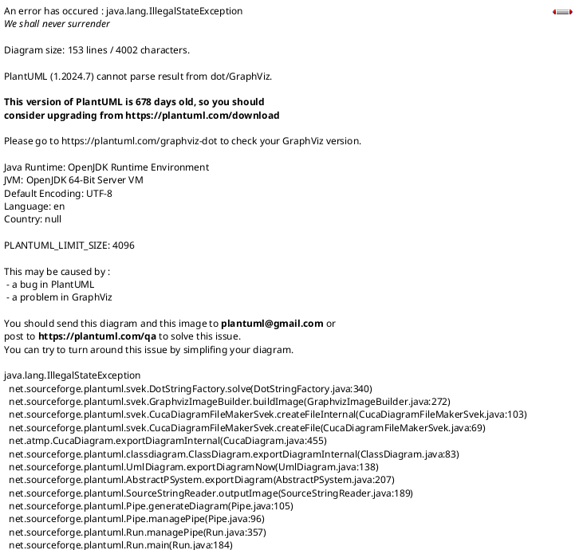

# CodeQuiz - UML Class Diagrams

## 1. Domain Model Class Diagram (Overview)


---

## 2. Authentication Module Class Diagram



---

## 3. Quiz Management Module Class Diagram


---

## 4. Code Execution Module Class Diagram


---

## 5. MAUI Application Class Diagram


---

## 6. System Architecture Class Diagram


---

## 7. Entity Relationship Diagram


---

## 8. Repository Pattern Class Diagram


---

## 9. Observer Pattern (SignalR) Class Diagram


---

## 10. Factory Pattern (Code Runner) Class Diagram


---

## 11. Decorator Pattern (Sandboxed Code Runner) Class Diagram


### Decorator Pattern Explanation

The **Decorator Pattern** is used in the Code Execution module to dynamically add responsibilities to code runners without modifying their structure.

#### Pattern Components:

| Component | Class | Responsibility |
|-----------|-------|----------------|
| **Component Interface** | `ICodeRunner` | Defines the interface for objects that can have responsibilities added dynamically |
| **Concrete Component** | `CSharpCodeRunner` | Basic implementation that executes code directly |
| **Base Decorator** | `CodeRunnerDecorator` | Abstract class maintaining a reference to a component object (to be implemented) |
| **Concrete Decorator** | `SandboxedCodeRunner` | Adds sandboxing behavior to the wrapped component |

#### Benefits in CodeQuiz:

1. **Single Responsibility**: Each decorator handles one concern (sandboxing)
2. **Open/Closed Principle**: New behaviors can be added without modifying existing code
3. **Flexible Composition**: Decorators can be stacked in the future
4. **Runtime Configuration**: Decoration can be applied conditionally based on configuration

#### Current Implementation:

```csharp
// Create base runner
ICodeRunner baseRunner = new CSharpCodeRunner();

// Wrap with sandbox decorator
ICodeRunner sandboxedRunner = new SandboxedCodeRunner(
    baseRunner, 
    dockerSandbox, 
    sandboxConfig, 
    logger
);

// Execute code - sandbox decorator is applied transparently
var result = await sandboxedRunner.RunCodeAsync(code, options);
```

---

## 12. Strategy Pattern (Code Runner) Class Diagram


### Strategy Pattern Explanation

The **Strategy Pattern** is used in the Code Execution module to define a family of algorithms (code runners), encapsulate each one, and make them interchangeable.

#### Pattern Components:

| Component | Class | Responsibility |
|-----------|-------|----------------|
| **Strategy Interface** | `ICodeRunner` | Declares the interface common to all supported algorithms |
| **Concrete Strategies** | `CSharpCodeRunner`, `SandboxedCodeRunner` | Implement the algorithm using the Strategy interface |
| **Context** | `Evaluator`, `ExecutionController` | Uses a Strategy to execute code |
| **Factory** | `CodeRunnerFactory` | Creates the appropriate strategy at runtime |

#### How It's Used in CodeQuiz:

**1. ExecutionController - Running User Code:**
```csharp
[HttpPost("run")]
public async Task<ActionResult<ApiResponse<CodeRunnerResult>>> RunCode([FromBody] RunCodeRequest request)
{
    // Factory selects the appropriate strategy based on language
    var codeRunner = codeRunnerFactory.Create(request.Language);
    
    // Strategy is executed - caller doesn't know which implementation
    var result = await codeRunner.RunCodeAsync(request.Code, new CodeRunnerOptions
    {
        Input = request.Input,
        ContainOutput = request.ContainOutput,
        ContainError = request.ContainError
    });
    
    return Ok(new ApiResponse<CodeRunnerResult> { Success = true, Data = result });
}
```

**2. Evaluator - Evaluating Solutions Against Test Cases:**
```csharp
public async Task<EvaluationResult> EvaluateAsync(string language, string code, TestCase testCase)
{
    // Factory creates the appropriate strategy
    var codeRunner = codeRunnerFactory.Create(language);
    
    // Execute using the strategy
    var result = await codeRunner.RunCodeAsync(code, new CodeRunnerOptions
    {
        Input = testCase.Input,
        ContainOutput = true,
        ContainError = true
    });

    return new EvaluationResult
    {
        TestCase = testCase,
        Output = result.Output ?? string.Empty,
        IsSuccessful = result.Success && (result.Output?.Trim() == testCase.ExpectedOutput.Trim())
    };
}
```

**3. AttemptsService - Grading Solutions:**
```csharp
private bool TestCasesPassed(Quiz quiz, Question question, Solution solution)
{
    var questionConfig = question.QuestionConfiguration ?? quiz.GlobalQuestionConfiguration;
    
    foreach (var testCase in question.TestCases)
    {
        // Evaluator uses the strategy pattern internally
        var result = evaluator.EvaluateAsync(questionConfig.Language, solution.Code, testCase).Result;
        if (!result.IsSuccessful)
        {
            return false;
        }
    }
    return true;
}
```

#### Benefits in CodeQuiz:

1. **Language Independence**: The system can support multiple programming languages by adding new `ICodeRunner` implementations
2. **Runtime Selection**: The factory selects the appropriate strategy at runtime based on the quiz configuration
3. **Easy Extension**: Adding support for a new language (e.g., Python, Java) requires only implementing `ICodeRunner`
4. **Testability**: Strategies can be mocked for unit testing
5. **Separation of Concerns**: Each language's execution logic is encapsulated in its own class

#### Future Extension Example:

```csharp
// Adding Python support - just implement the interface
public class PythonCodeRunner : ICodeRunner
{
    public string Language => "Python";
    
    public async Task<CodeRunnerResult> RunCodeAsync(string code, CodeRunnerOptions? options = null)
    {
        // Python-specific execution logic
    }
}

// Register in DI container
services.AddTransient<PythonCodeRunner>();

// Factory automatically handles it based on language parameter
var runner = codeRunnerFactory.Create("Python"); // Returns PythonCodeRunner
```

---

## Class Diagram Summary Table

| Diagram | Description | Key Classes |
|---------|-------------|-------------|
| 1. Domain Model Overview | Core business entities | Quiz, Question, Attempt, Solution, User |
| 2. Authentication Module | User authentication & authorization | User, JWTAuthenticationService, TokenService |
| 3. Quiz Management Module | Quiz CRUD and attempt management | Quiz, QuizzesService, AttemptsService |
| 4. Code Execution Module | Code running and evaluation | ICodeRunner, Evaluator, DockerSandbox |
| 5. MAUI Application | Client-side architecture | ViewModels, Repositories, APIs |
| 6. System Architecture | Layered architecture overview | Presentation, Application, Domain, Infrastructure |
| 7. Entity Relationship | Database schema | All entities with relationships |
| 8. Repository Pattern | Data access abstraction | IUsersRepository, IQuizzesRepository |
| 9. Observer Pattern | Real-time updates with SignalR | AttemptsHub, BaseObservableRepository |
| 10. Factory Pattern | Code runner creation | ICodeRunnerFactory, CodeRunnerFactory |
| 11. Decorator Pattern | Sandboxed code execution | SandboxedCodeRunner, CodeRunnerDecorator |
| 12. Strategy Pattern | Interchangeable code execution | ICodeRunner, CSharpCodeRunner, Evaluator |

---

## How to Render PlantUML Diagrams
