# CodeQuiz - UML Sequence Diagrams

## 1. User Registration Sequence Diagram

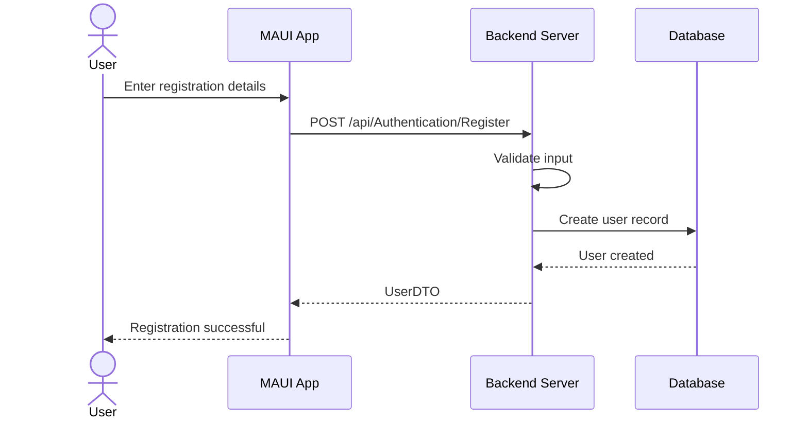

---

## 2. User Login Sequence Diagram

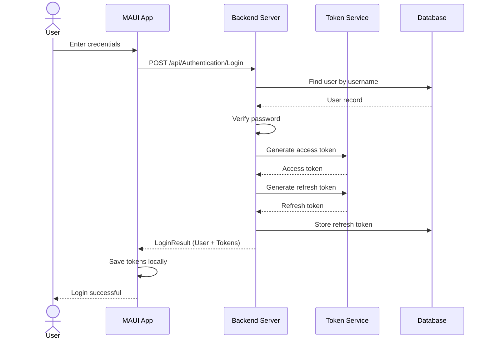

---

## 3. Token Refresh Sequence Diagram

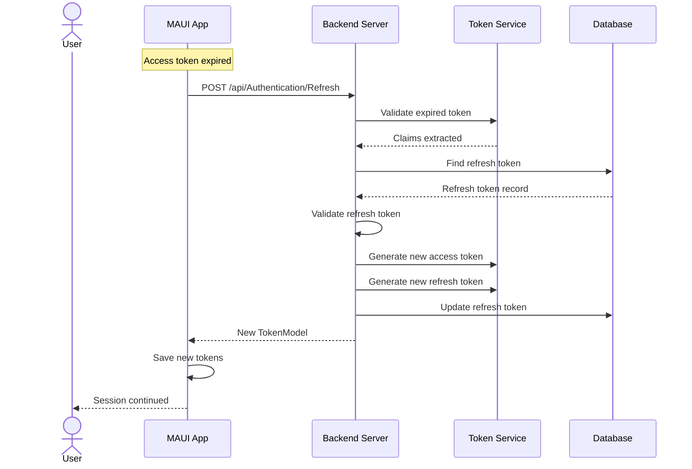

---

## 4. Create Quiz Sequence Diagram

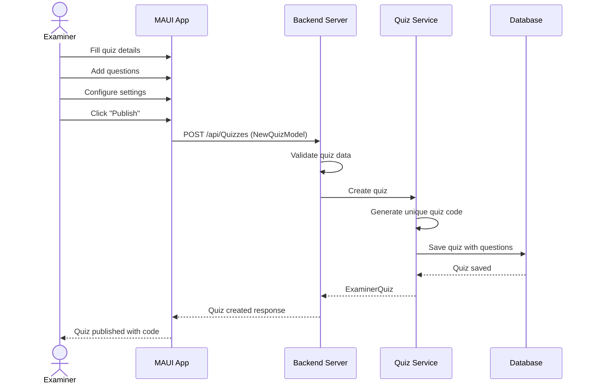

---

## 5. Join Quiz Sequence Diagram

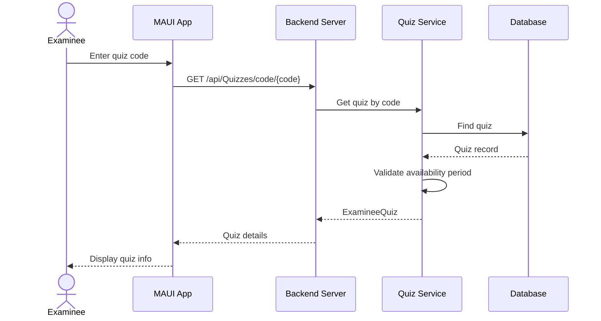

---

## 6. Begin Quiz Attempt Sequence Diagram

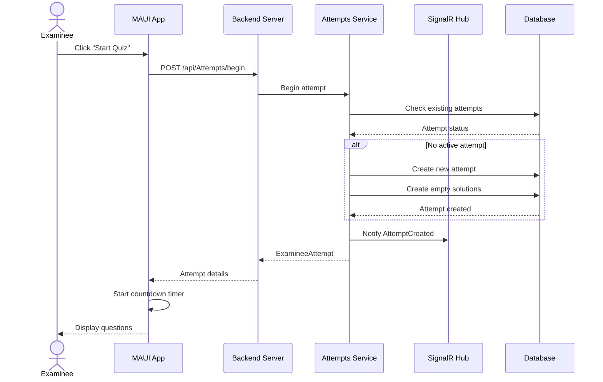

---

## 7. Answer Question & Save Solution Sequence Diagram

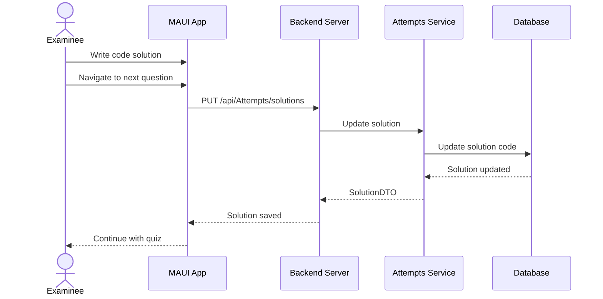

---

## 8. Run Code Sequence Diagram

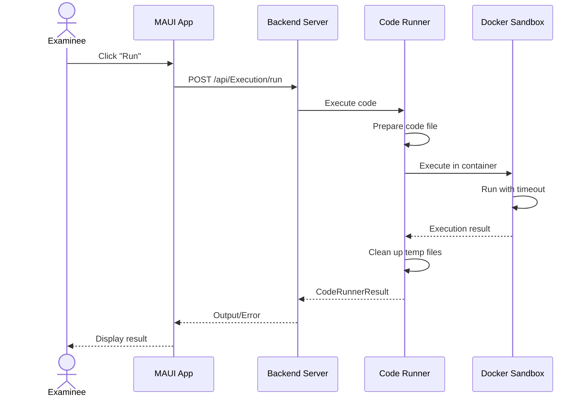

---

## 9. Submit Quiz Attempt Sequence Diagram

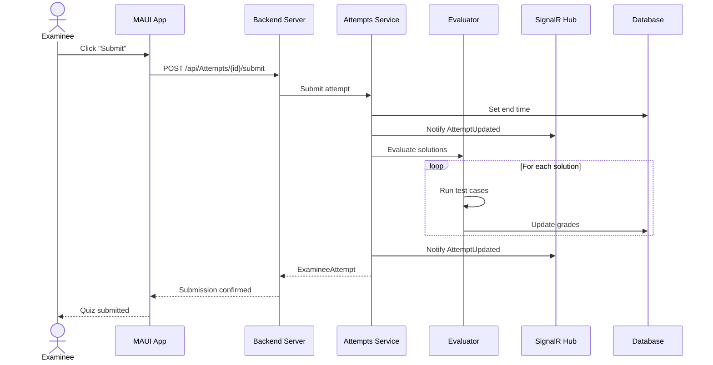

---

## 10. Auto-Submit on Timeout Sequence Diagram

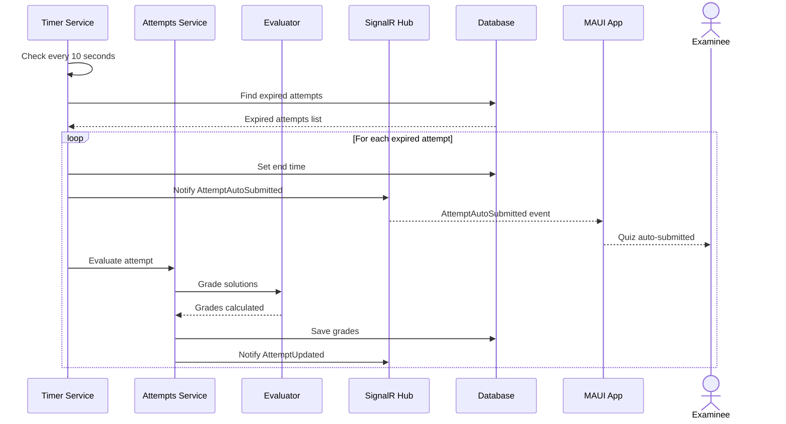

---

## 11. View Quiz Attempts (Examiner) Sequence Diagram

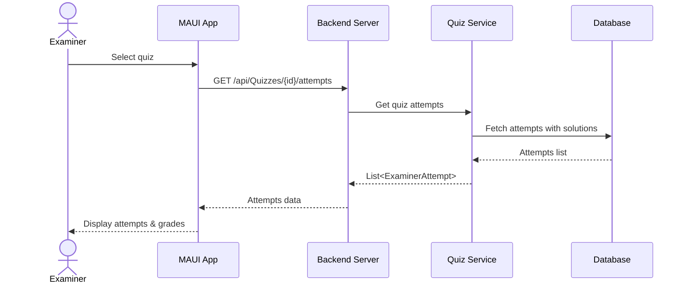

---

## 12. Code Evaluation Sequence Diagram

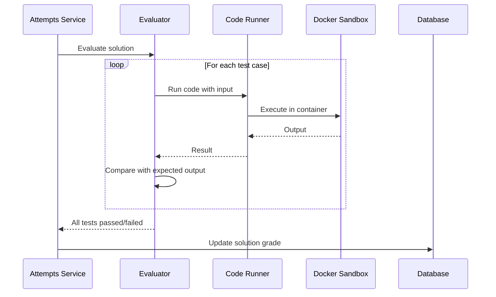

---

## 13. Real-time Updates via SignalR Sequence Diagram

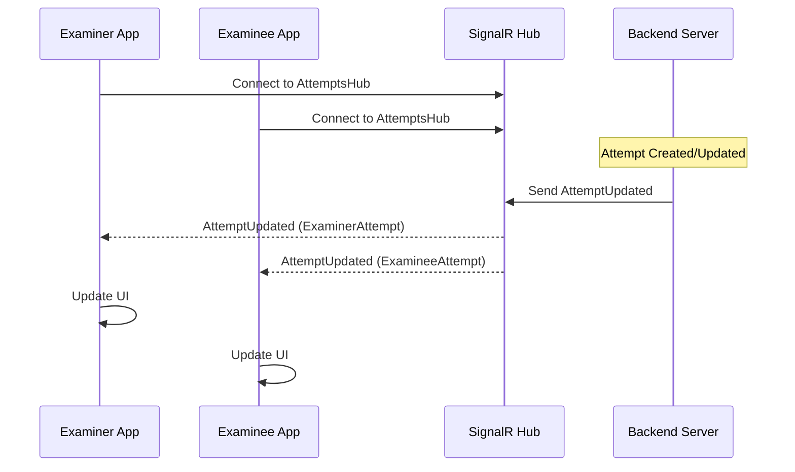

---

## 14. Password Reset Sequence Diagram

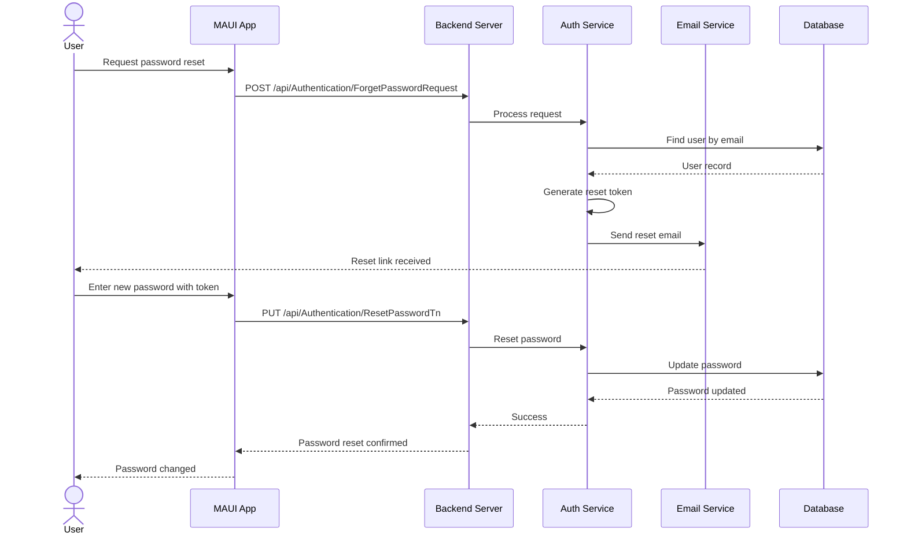

---

## 15. Complete Quiz Flow Sequence Diagram (Overview)

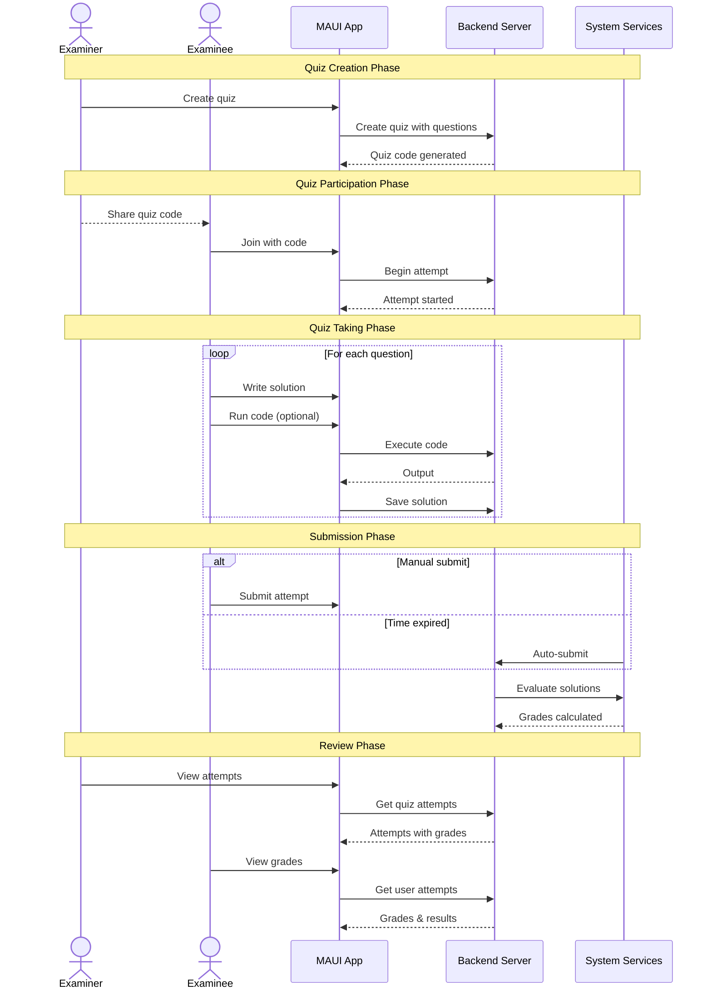

---

## Sequence Diagram Summary Table

| Diagram | Actors | Primary Flow |
|---------|--------|--------------|
| 1. Registration | User | User creates account |
| 2. Login | User | User authenticates |
| 3. Token Refresh | User | Session renewal |
| 4. Create Quiz | Examiner | Quiz publication |
| 5. Join Quiz | Examinee | Quiz discovery |
| 6. Begin Attempt | Examinee | Start quiz session |
| 7. Save Solution | Examinee | Code persistence |
| 8. Run Code | Examinee | Code execution |
| 9. Submit Attempt | Examinee | Manual submission |
| 10. Auto-Submit | System | Timeout submission |
| 11. View Attempts | Examiner | Progress monitoring |
| 12. Evaluation | System | Automated grading |
| 13. Real-time Updates | All | SignalR notifications |
| 14. Password Reset | User | Account recovery |
| 15. Complete Flow | All | End-to-end overview |
