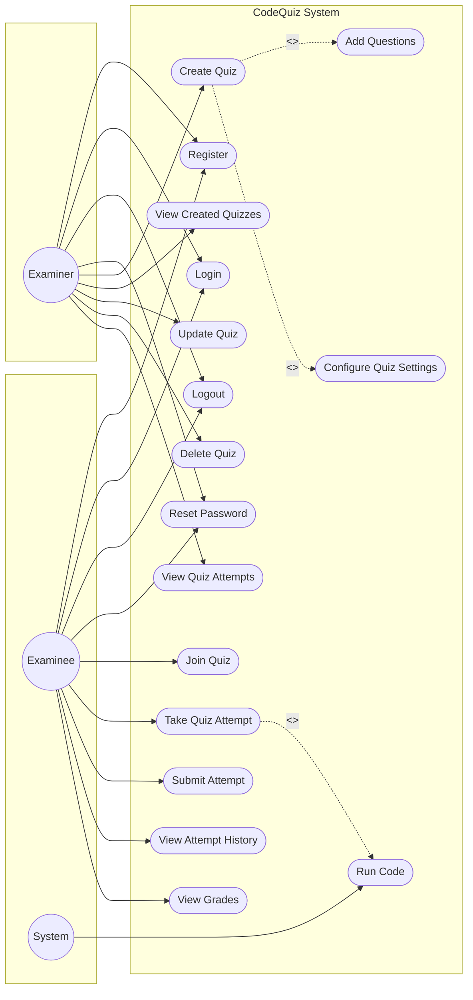
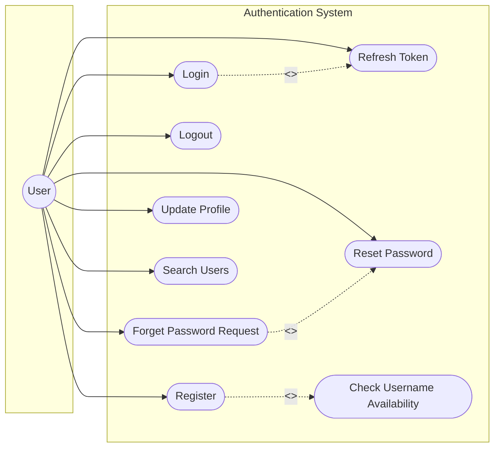
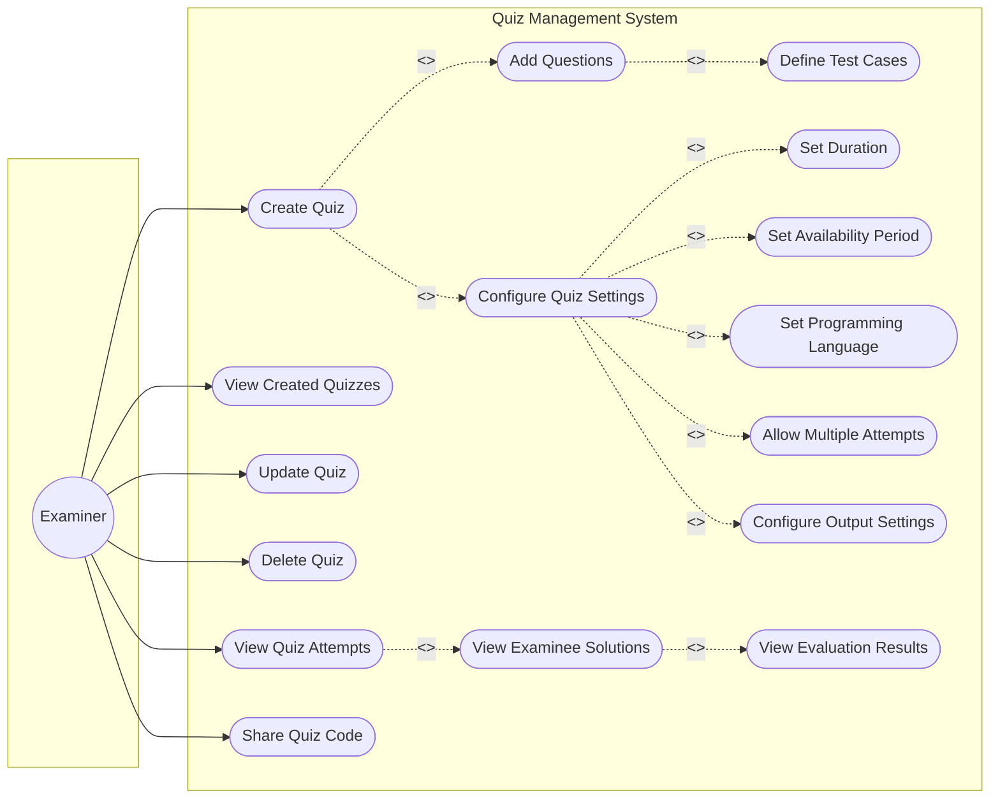
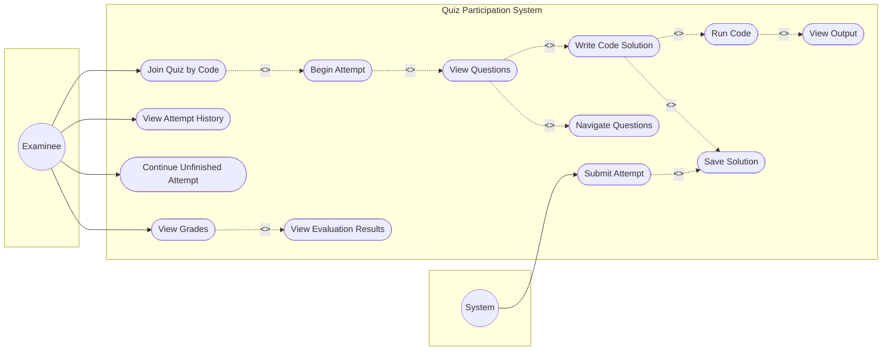
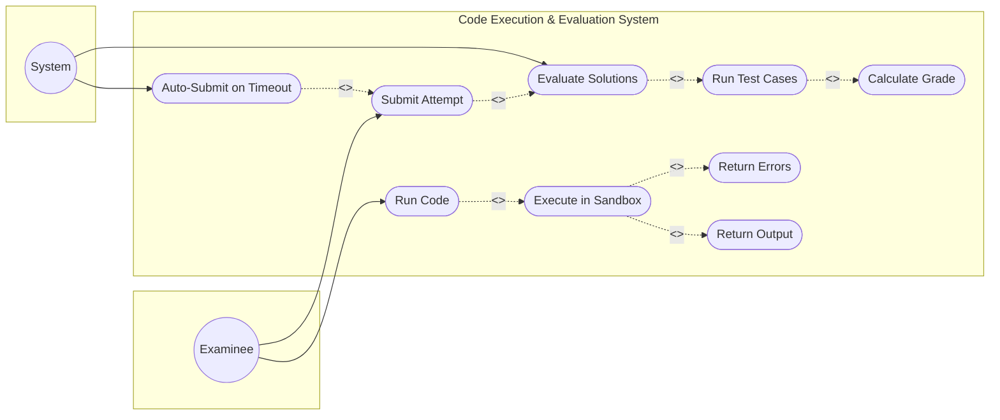
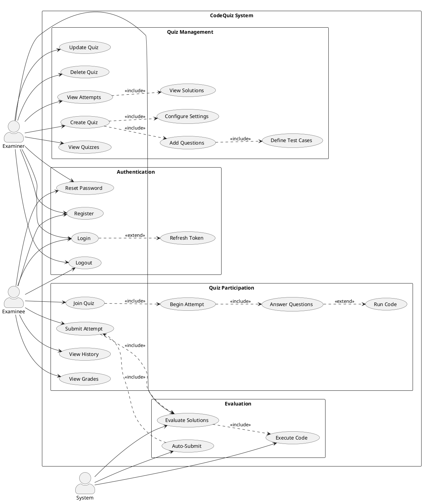

# CodeQuiz - UML Use Case Diagrams

## 1. System Overview Use Case Diagram



---

## 2. Authentication Module Use Case Diagram



---

## 3. Examiner Use Case Diagram (Quiz Management)



---

## 4. Examinee Use Case Diagram (Quiz Participation)



---

## 5. Code Execution & Evaluation Use Case Diagram



---

## 6. Complete System Use Case Diagram (PlantUML Format)

For more traditional UML rendering, here's the PlantUML version:



---

## 7. Draw.io XML Format

You can import this XML directly into draw.io:

```xml
<mxfile host="app.diagrams.net">
  <diagram name="CodeQuiz Use Cases" id="use-case-main">
    <mxGraphModel dx="1434" dy="780" grid="1" gridSize="10" guides="1" tooltips="1" connect="1" arrows="1" fold="1" page="1" pageScale="1" pageWidth="1169" pageHeight="827" math="0" shadow="0">
      <root>
        <mxCell id="0" />
        <mxCell id="1" parent="0" />
        
        <!-- System Boundary -->
        <mxCell id="system" value="CodeQuiz System" style="shape=umlFrame;whiteSpace=wrap;html=1;width=120;height=30;boundedLbl=1;verticalAlign=middle;align=left;spacingLeft=5;fillColor=#dae8fc;strokeColor=#6c8ebf;" vertex="1" parent="1">
          <mxGeometry x="200" y="40" width="700" height="700" as="geometry" />
        </mxCell>
        
        <!-- Actors -->
        <mxCell id="examiner" value="Examiner" style="shape=umlActor;verticalLabelPosition=bottom;verticalAlign=top;html=1;outlineConnect=0;" vertex="1" parent="1">
          <mxGeometry x="60" y="200" width="30" height="60" as="geometry" />
        </mxCell>
        
        <mxCell id="examinee" value="Examinee" style="shape=umlActor;verticalLabelPosition=bottom;verticalAlign=top;html=1;outlineConnect=0;" vertex="1" parent="1">
          <mxGeometry x="60" y="450" width="30" height="60" as="geometry" />
        </mxCell>
        
        <mxCell id="system_actor" value="System" style="shape=umlActor;verticalLabelPosition=bottom;verticalAlign=top;html=1;outlineConnect=0;" vertex="1" parent="1">
          <mxGeometry x="980" y="350" width="30" height="60" as="geometry" />
        </mxCell>
        
        <!-- Authentication Use Cases -->
        <mxCell id="uc_register" value="Register" style="ellipse;whiteSpace=wrap;html=1;fillColor=#fff2cc;strokeColor=#d6b656;" vertex="1" parent="1">
          <mxGeometry x="250" y="70" width="100" height="50" as="geometry" />
        </mxCell>
        
        <mxCell id="uc_login" value="Login" style="ellipse;whiteSpace=wrap;html=1;fillColor=#fff2cc;strokeColor=#d6b656;" vertex="1" parent="1">
          <mxGeometry x="380" y="70" width="100" height="50" as="geometry" />
        </mxCell>
        
        <mxCell id="uc_logout" value="Logout" style="ellipse;whiteSpace=wrap;html=1;fillColor=#fff2cc;strokeColor=#d6b656;" vertex="1" parent="1">
          <mxGeometry x="510" y="70" width="100" height="50" as="geometry" />
        </mxCell>
        
        <mxCell id="uc_reset" value="Reset Password" style="ellipse;whiteSpace=wrap;html=1;fillColor=#fff2cc;strokeColor=#d6b656;" vertex="1" parent="1">
          <mxGeometry x="640" y="70" width="100" height="50" as="geometry" />
        </mxCell>
        
        <!-- Quiz Participation Use Cases -->
        <mxCell id="uc_join" value="Join Quiz" style="ellipse;whiteSpace=wrap;html=1;fillColor=#e1d5e7;strokeColor=#9673a6;" vertex="1" parent="1">
          <mxGeometry x="250" y="400" width="100" height="50" as="geometry" />
        </mxCell>
        
        <mxCell id="uc_begin" value="Begin Attempt" style="ellipse;whiteSpace=wrap;html=1;fillColor=#e1d5e7;strokeColor=#9673a6;" vertex="1" parent="1">
          <mxGeometry x="400" y="400" width="100" height="50" as="geometry" />
        </mxCell>
        
        <mxCell id="uc_answer" value="Answer Questions" style="ellipse;whiteSpace=wrap;html=1;fillColor=#e1d5e7;strokeColor=#9673a6;" vertex="1" parent="1">
          <mxGeometry x="550" y="400" width="110" height="50" as="geometry" />
        </mxCell>
        
        <mxCell id="uc_run" value="Run Code" style="ellipse;whiteSpace=wrap;html=1;fillColor=#e1d5e7;strokeColor=#9673a6;" vertex="1" parent="1">
          <mxGeometry x="700" y="400" width="100" height="50" as="geometry" />
        </mxCell>
        
        <mxCell id="uc_submit" value="Submit Attempt" style="ellipse;whiteSpace=wrap;html=1;fillColor=#e1d5e7;strokeColor=#9673a6;" vertex="1" parent="1">
          <mxGeometry x="250" y="480" width="100" height="50" as="geometry" />
        </mxCell>
        
        <mxCell id="uc_history" value="View History" style="ellipse;whiteSpace=wrap;html=1;fillColor=#e1d5e7;strokeColor=#9673a6;" vertex="1" parent="1">
          <mxGeometry x="380" y="480" width="100" height="50" as="geometry" />
        </mxCell>
        
        <mxCell id="uc_grades" value="View Grades" style="ellipse;whiteSpace=wrap;html=1;fillColor=#e1d5e7;strokeColor=#9673a6;" vertex="1" parent="1">
          <mxGeometry x="510" y="480" width="100" height="50" as="geometry" />
        </mxCell>
        
        <!-- Evaluation Use Cases -->
        <mxCell id="uc_exec" value="Execute Code" style="ellipse;whiteSpace=wrap;html=1;fillColor=#f8cecc;strokeColor=#b85450;" vertex="1" parent="1">
          <mxGeometry x="550" y="580" width="100" height="50" as="geometry" />
        </mxCell>
        
        <mxCell id="uc_eval" value="Evaluate Solutions" style="ellipse;whiteSpace=wrap;html=1;fillColor=#f8cecc;strokeColor=#b85450;" vertex="1" parent="1">
          <mxGeometry x="700" y="580" width="110" height="50" as="geometry" />
        </mxCell>
        
        <mxCell id="uc_auto" value="Auto-Submit on Timeout" style="ellipse;whiteSpace=wrap;html=1;fillColor=#f8cecc;strokeColor=#b85450;" vertex="1" parent="1">
          <mxGeometry x="700" y="660" width="130" height="50" as="geometry" />
        </mxCell>
        
      </root>
    </mxGraphModel>
  </diagram>
</mxfile>
```

---

## Use Case Descriptions Summary

| ID | Use Case | Actor(s) | Description |
|----|----------|----------|-------------|
| UC1 | Register | User | Create a new account in the system |
| UC2 | Login | User | Authenticate and access the system |
| UC3 | Logout | User | End the current session |
| UC4 | Reset Password | User | Recover account access |
| UC5 | Create Quiz | Examiner | Create a new quiz with questions |
| UC6 | Add Questions | Examiner | Add coding questions to a quiz |
| UC7 | Configure Settings | Examiner | Set quiz duration, language, etc. |
| UC8 | View Quizzes | Examiner | List all created quizzes |
| UC9 | Update Quiz | Examiner | Modify existing quiz |
| UC10 | Delete Quiz | Examiner | Remove a quiz from the system |
| UC11 | View Attempts | Examiner | See all attempts for a quiz |
| UC12 | Join Quiz | Examinee | Enter a quiz using a code |
| UC13 | Begin Attempt | Examinee | Start taking a quiz |
| UC14 | Answer Questions | Examinee | Write code solutions |
| UC15 | Run Code | Examinee | Execute code to test solutions |
| UC16 | Submit Attempt | Examinee/System | Finalize and submit the attempt |
| UC17 | View History | Examinee | See past quiz attempts |
| UC18 | View Grades | Examinee | Check scores and results |
| UC19 | Execute Code | System | Run code in sandboxed environment |
| UC20 | Evaluate Solutions | System | Run test cases and grade |
| UC21 | Auto-Submit | System | Submit when time expires |

