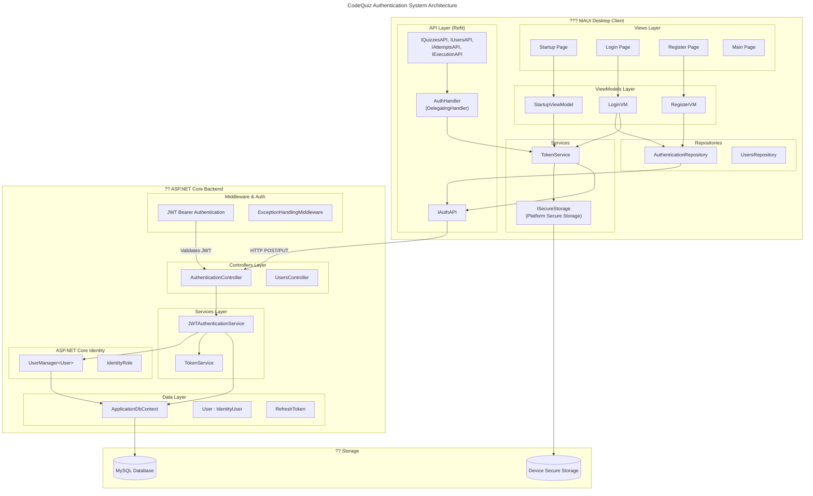

# Authentication System Architecture

This diagram shows the high-level architecture of the CodeQuiz authentication system, including both the MAUI client and ASP.NET Core backend components.

## Component Descriptions

### MAUI Client Components

| Component | Responsibility |
|-----------|---------------|
| **Views** | UI pages for login, registration, and main app |
| **ViewModels** | Handle UI logic and coordinate with repositories |
| **TokenService** | Manage token storage, validation, and refresh |
| **AuthenticationRepository** | Coordinate authentication operations |
| **IAuthAPI** | Refit interface for HTTP calls to backend |
| **AuthHandler** | HTTP message handler that attaches JWT to requests |

### Backend Components

| Component | Responsibility |
|-----------|---------------|
| **AuthenticationController** | REST API endpoints for auth operations |
| **JWTAuthenticationService** | Core authentication logic |
| **TokenService** | Generate and validate JWT and refresh tokens |
| **UserManager** | ASP.NET Core Identity user management |
| **ApplicationDbContext** | Entity Framework database context |

### Data Flow

1. **Unauthenticated requests** (login, register) go directly to `IAuthAPI`
2. **Authenticated requests** pass through `AuthHandler` which:
   - Gets valid tokens from `TokenService`
   - Attaches Bearer token to request headers
3. **Backend** validates JWT via `JwtBearerAuthentication` middleware
4. **Refresh flow** is triggered automatically when tokens are expiring
