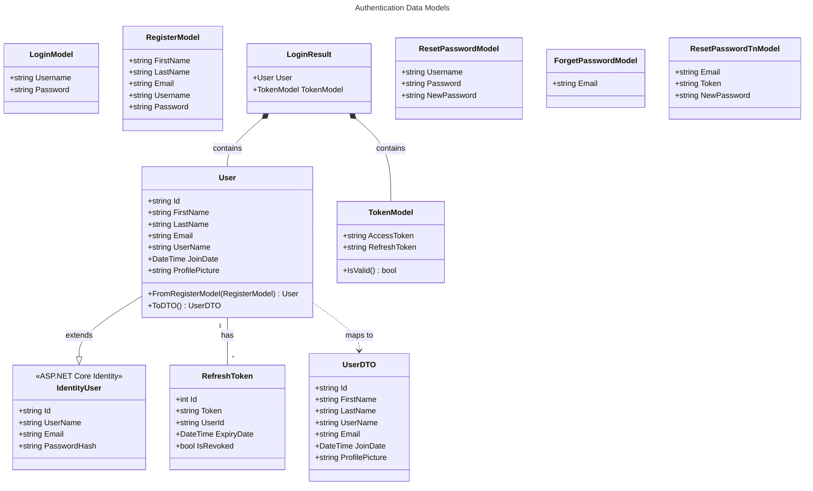

# Authentication Data Models

This document describes the data models used in the authentication system.



## Backend Models

### User (Entity)

Extends ASP.NET Core Identity's `IdentityUser`:

```csharp
// CodeQuizBackend\Authentication\Models\User.cs
public class User : IdentityUser
{
    public required string FirstName { get; set; }
    public required string LastName { get; set; }
    public DateTime JoinDate { get; set; } = DateTime.Now;
    public string? ProfilePicture { get; set; }
}
```

### RefreshToken (Entity)

Stored in database for token refresh validation:

```csharp
// CodeQuizBackend\Authentication\Models\RefreshToken.cs
public class RefreshToken
{
    [Key]
    public int Id { get; set; }
    public required string Token { get; set; }
    public required string UserId { get; set; }
    public DateTime ExpiryDate { get; set; }
    public bool IsRevoked { get; set; }
}
```

### TokenModel

Returned to client after successful authentication:

```csharp
// CodeQuizBackend\Authentication\Models\TokenModel.cs
public class TokenModel
{
    public required string AccessToken { get; set; }
    public required string RefreshToken { get; set; }
}
```

### LoginModel

Request body for login endpoint:

```csharp
// CodeQuizBackend\Authentication\Models\LoginModel.cs
public class LoginModel
{
    public required string Username { get; set; }
    public required string Password { get; set; }
}
```

### RegisterModel

Request body for registration endpoint:

```csharp
// CodeQuizBackend\Authentication\Models\RegisterModel.cs
public class RegisterModel
{
    public required string FirstName { get; set; }
    public required string LastName { get; set; }
    public required string Email { get; set; }
    public required string Username { get; set; }
    public required string Password { get; set; }
}
```

### LoginResult

Response from login endpoint:

```csharp
// CodeQuizBackend\Authentication\Models\LoginResult.cs
public class LoginResult
{
    public required User User { get; set; }
    public required TokenModel TokenModel { get; set; }
}
```

### Password Reset Models

```csharp
// Direct password reset (authenticated)
public class ResetPasswordModel
{
    public required string Username { get; set; }
    public required string Password { get; set; }      // Current password
    public required string NewPassword { get; set; }
}

// Request password reset email
public class ForgetPasswordModel
{
    public required string Email { get; set; }
}

// Reset password using email token
public class ResetPasswordTnModel
{
    public required string Email { get; set; }
    public required string Token { get; set; }
    public required string NewPassword { get; set; }
}
```

## Client Models (MAUI)

### TokenModel (Client)

Extended with validation logic:

```csharp
// CodeQuizDesktop\Models\Authentication\TokenModel.cs
public class TokenModel
{
    public required string AccessToken { get; set; }
    public required string RefreshToken { get; set; }

    private DateTime ExpiryFromToken()
    {
        var handler = new JwtSecurityTokenHandler();
        var jwt = handler.ReadJwtToken(AccessToken);
        return jwt.ValidTo.ToLocalTime();
    }

    public bool IsValid()
    {
        return ExpiryFromToken().Subtract(DateTime.Now).TotalMinutes > 5;
    }
}
```

## Database Schema

### Users Table (ASP.NET Core Identity)

| Column | Type | Description |
|--------|------|-------------|
| Id | NVARCHAR(450) | Primary key (GUID) |
| UserName | NVARCHAR(256) | Unique username |
| NormalizedUserName | NVARCHAR(256) | Uppercase username for lookup |
| Email | NVARCHAR(256) | User email |
| NormalizedEmail | NVARCHAR(256) | Uppercase email for lookup |
| EmailConfirmed | BIT | Email verification status |
| PasswordHash | NVARCHAR(MAX) | Hashed password |
| SecurityStamp | NVARCHAR(MAX) | Security stamp for invalidation |
| FirstName | NVARCHAR(MAX) | User's first name |
| LastName | NVARCHAR(MAX) | User's last name |
| JoinDate | DATETIME | Registration date |
| ProfilePicture | NVARCHAR(MAX) | Profile picture URL |

### RefreshTokens Table

| Column | Type | Description |
|--------|------|-------------|
| Id | INT | Primary key (auto-increment) |
| Token | NVARCHAR(MAX) | Refresh token value (GUID) |
| UserId | NVARCHAR(450) | Foreign key to Users |
| ExpiryDate | DATETIME | Token expiration date |
| IsRevoked | BIT | Revocation status |

## API Response Wrapper

All API responses are wrapped in a standard format:

```csharp
public class ApiResponse<T>
{
    public bool Success { get; set; }
    public T? Data { get; set; }
    public string? Message { get; set; }
}
```

Example response:
```json
{
    "success": true,
    "data": {
        "user": { ... },
        "tokenModel": {
            "accessToken": "eyJ...",
            "refreshToken": "..."
        }
    },
    "message": "User logged in successfully"
}
```
