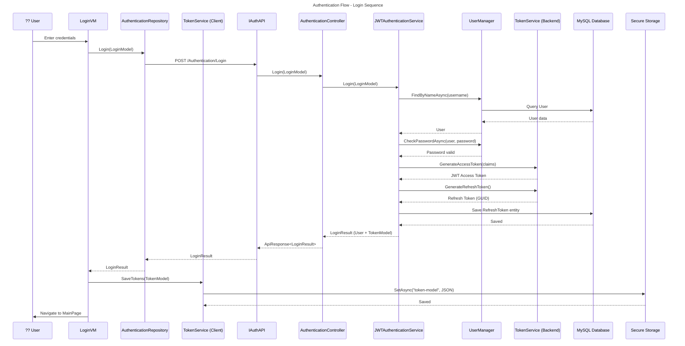

# Login Flow

This diagram shows the detailed sequence of events during a user login operation.



## Login Process Steps

### Client-Side (MAUI)

1. **User Input**: User enters username and password in `Login.xaml`
2. **ViewModel Processing**: `LoginVM` creates a `LoginModel` and calls `AuthenticationRepository.Login()`
3. **API Call**: `AuthenticationRepository` uses `IAuthAPI` (Refit) to make HTTP POST request
4. **Token Storage**: Upon successful response, tokens are saved to secure storage via `TokenService`
5. **Navigation**: User is redirected to the main page

### Server-Side (Backend)

1. **Request Handling**: `AuthenticationController.Login()` receives the request
2. **User Lookup**: `JWTAuthenticationService` uses `UserManager` to find user by username
3. **Password Verification**: `UserManager.CheckPasswordAsync()` validates the password hash
4. **Token Generation**:
   - Access token (JWT) with claims: `uid`, `jti`
   - Refresh token (GUID)
5. **Persistence**: Refresh token is saved to database with expiry date
6. **Response**: `LoginResult` containing user info and both tokens is returned

## LoginModel Structure

```csharp
public class LoginModel
{
    public string Username { get; set; }
    public string Password { get; set; }
}
```

## LoginResult Structure

```csharp
public class LoginResult
{
    public User User { get; set; }
    public TokenModel TokenModel { get; set; }
}
```

## Error Handling

| Scenario | Error |
|----------|-------|
| User not found | "Invalid username or password" |
| Wrong password | "Invalid username or password" |
| Network error | Caught by client, shown to user |

## Security Notes

- Passwords are never stored in plain text
- Same error message for both "user not found" and "wrong password" to prevent user enumeration
- JWT tokens have configurable expiry time
- Refresh tokens are stored in database and can be revoked
