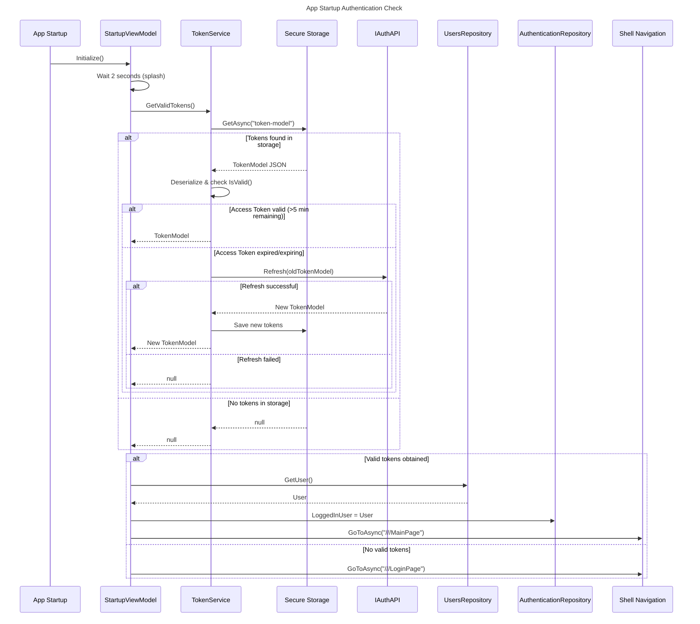
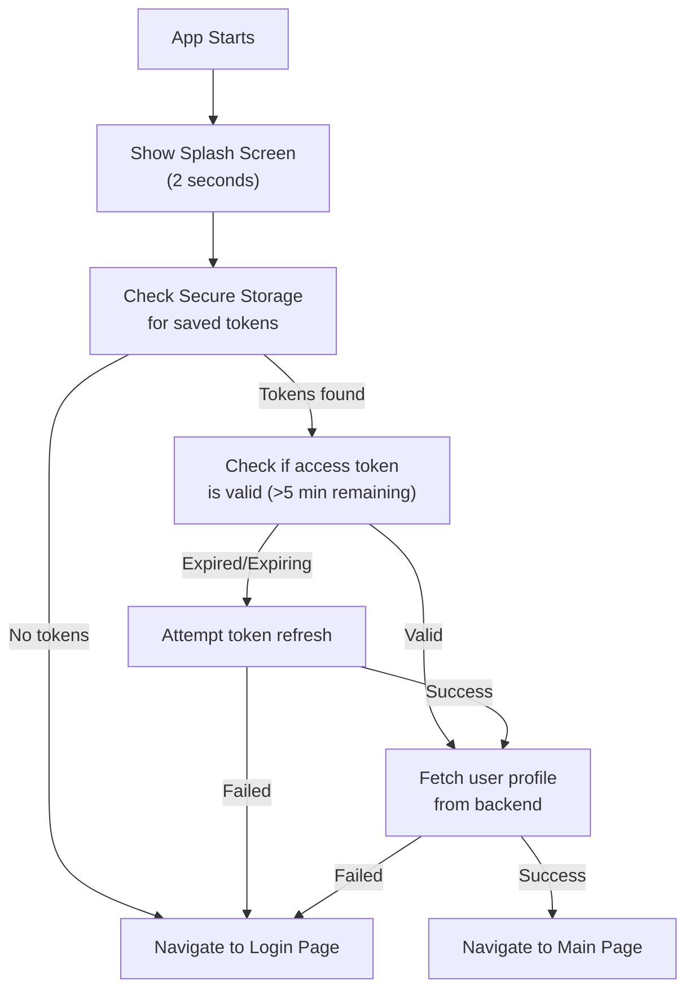

# App Startup Authentication Flow

This diagram shows how the application determines whether to show the login page or main page on startup.



## Startup Process

### StartupViewModel Implementation

```csharp
public class StartupViewModel : BaseViewModel
{
    public StartupViewModel(
        ITokenService tokenService, 
        IAuthenticationRepository authenticationRepository, 
        IUsersRepository usersRepository)
    {
        // ...
        Initialize();
    }

    public async void Initialize()
    {
        await Task.Delay(2000);  // Splash screen delay
        var token = await tokenService.GetValidTokens();
        
        if (token != null)
        {
            authenticationRepository.LoggedInUser = await usersRepository.GetUser();
            await Shell.Current.GoToAsync("///MainPage");
        }
        else
        {
            await Shell.Current.GoToAsync("///LoginPage");
        }
    }
}
```

### Decision Logic



## Token Storage

Tokens are stored using platform-specific secure storage:

| Platform | Storage Mechanism |
|----------|------------------|
| **Windows** | Windows Credential Manager |
| **macOS** | Keychain |
| **iOS** | Keychain |
| **Android** | Android Keystore |

### Storage Key

```
Key: "token-model"
Value: JSON serialized TokenModel
```

Example stored value:
```json
{
    "AccessToken": "eyJhbGciOiJIUzI1NiIsInR5cCI6IkpXVCJ9...",
    "RefreshToken": "a1b2c3d4-e5f6-7890-abcd-ef1234567890"
}
```

## Session Restoration

When valid tokens are found:

1. **Get user profile** via `UsersRepository.GetUser()`
2. **Set logged-in user** in `AuthenticationRepository.LoggedInUser`
3. **Navigate** to the main page

This allows the app to seamlessly restore the user session without requiring re-authentication.

## Edge Cases

| Scenario | Behavior |
|----------|----------|
| First app launch | No tokens ? Login page |
| Token valid | Main page |
| Token expired, refresh valid | Refresh ? Main page |
| Token expired, refresh expired | Login page |
| Token valid, user fetch fails | Should handle gracefully (currently may cause issues) |
| Network unavailable | Refresh fails ? Login page |

## Security Considerations

1. **Secure Storage**: Platform-specific secure storage protects tokens at rest
2. **Token Validation**: Expired tokens trigger server-side validation via refresh
3. **User Verification**: User profile is fetched to ensure account still exists
4. **Session Continuity**: Users don't need to re-authenticate on every app launch
