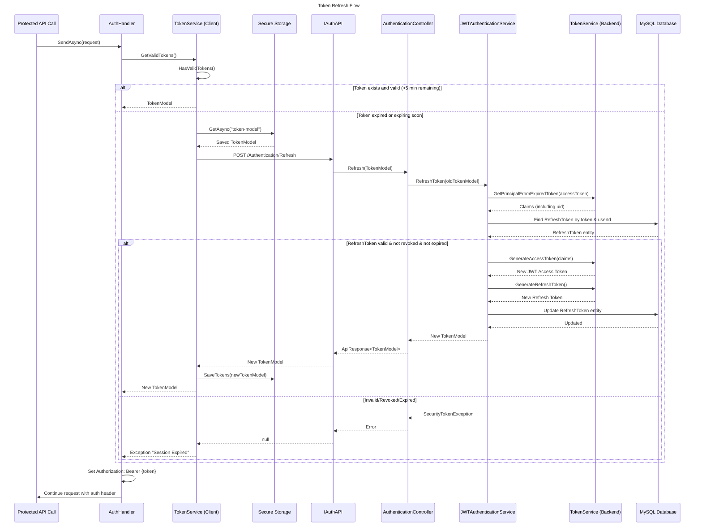

# Token Refresh Flow

This diagram shows how the authentication system automatically refreshes expired tokens.



## How Token Refresh Works

### Client-Side Token Validation

The client-side `TokenService` checks if tokens are valid before making API calls:

```csharp
public bool IsValid()
{
    return ExpiryFromToken().Subtract(DateTime.Now).TotalMinutes > 5;
}
```

Tokens are considered "expiring" when less than **5 minutes** remain before expiry. This buffer ensures:
- API calls don't fail mid-request due to token expiry
- Proactive refresh before the token becomes invalid

### AuthHandler Integration

The `AuthHandler` is a `DelegatingHandler` that intercepts all HTTP requests to protected endpoints:

```csharp
protected override async Task<HttpResponseMessage> SendAsync(
    HttpRequestMessage request, 
    CancellationToken cancellationToken)
{
    var token = await tokenService.GetValidTokens() 
        ?? throw new Exception("Session Expired");
    
    request.Headers.Authorization = 
        new AuthenticationHeaderValue("Bearer", token.AccessToken);
    
    return await base.SendAsync(request, cancellationToken);
}
```

### Server-Side Refresh Logic

1. **Extract claims** from expired access token (lifetime validation disabled)
2. **Validate refresh token** in database:
   - Token matches
   - User ID matches
   - Not revoked
   - Not expired
3. **Generate new tokens**:
   - New JWT access token with same claims
   - New refresh token (GUID)
4. **Update database** with new refresh token

### Refresh Token Rotation

For security, refresh tokens are **rotated** on each refresh:
- Old refresh token is replaced with new one
- Prevents replay attacks with stolen refresh tokens
- Each refresh extends the session validity

## Configuration

| Setting | Description | Location |
|---------|-------------|----------|
| `JWTExpiresInMinutes` | Access token lifetime | Backend `appsettings.json` |
| `RefreshTokenExpiresInDays` | Refresh token lifetime | Backend `appsettings.json` |
| 5 minutes | Client-side refresh buffer | `TokenModel.IsValid()` |

## Error Scenarios

| Scenario | Client Behavior |
|----------|-----------------|
| Refresh token expired | Throw "Session Expired", redirect to login |
| Refresh token revoked | Throw "Session Expired", redirect to login |
| Network error during refresh | Retry or show error to user |
| Invalid access token structure | Throw security exception |

## Concurrency Handling

The client `TokenService` prevents multiple simultaneous refresh calls:

```csharp
private Task<TokenModel?>? refreshTask = null;

private async Task<TokenModel?> RefreshTokens()
{
    if (refreshTask != null)
    {
        return await refreshTask;
    }
    // ... refresh logic
}
```

This ensures only one refresh request is made even if multiple API calls trigger refresh simultaneously.
