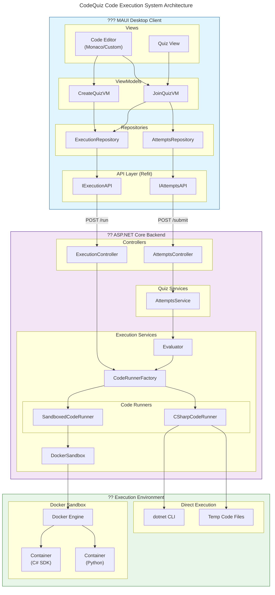

# Code Execution System Architecture

This diagram shows the high-level architecture of the CodeQuiz code execution system.



## Component Descriptions

### MAUI Client Components

| Component | Responsibility |
|-----------|---------------|
| **Code Editor** | User interface for writing code |
| **ExecutionRepository** | Coordinates code execution API calls |
| **IExecutionAPI** | Refit interface for execution endpoints |

### Backend Components

| Component | Responsibility |
|-----------|---------------|
| **ExecutionController** | REST API endpoint for code execution |
| **CodeRunnerFactory** | Creates appropriate code runner for language |
| **CSharpCodeRunner** | Executes C# code directly via dotnet CLI |
| **SandboxedCodeRunner** | Wraps code runners with Docker isolation |
| **DockerSandbox** | Manages Docker container lifecycle |
| **Evaluator** | Runs code against test cases for grading |
| **AttemptsService** | Manages quiz attempts and triggers evaluation |

### Execution Environment

| Component | Responsibility |
|-----------|---------------|
| **dotnet CLI** | Compiles and runs C# code |
| **Docker Engine** | Container runtime for sandboxed execution |
| **Containers** | Isolated environments for code execution |

## Data Flow

1. **User writes code** in the MAUI client's code editor
2. **Run request** is sent via `IExecutionAPI` to backend
3. **ExecutionController** receives request and delegates to `CodeRunnerFactory`
4. **CodeRunnerFactory** selects appropriate runner based on language
5. **Code Runner** executes code (directly or in Docker sandbox)
6. **Result** is returned through the chain back to client

## Two Execution Paths

### Path 1: Interactive Execution
```
User ? Code Editor ? ExecutionRepository ? ExecutionController ? CodeRunner ? Result
```

### Path 2: Quiz Evaluation
```
Submit Attempt ? AttemptsService ? Evaluator ? CodeRunner ? Grade Solutions
```
