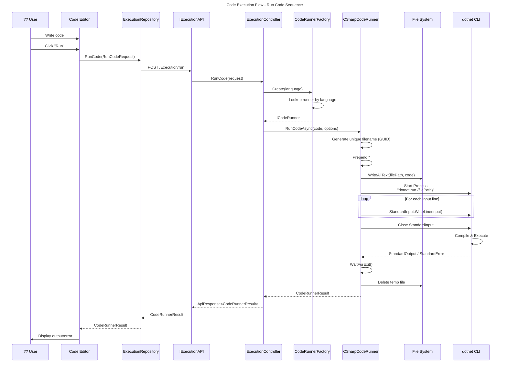
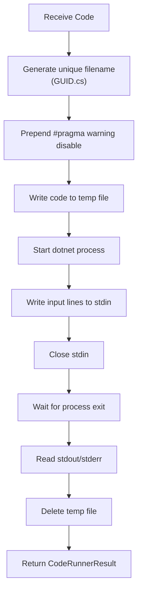

# Code Execution Flow

This diagram shows the detailed sequence of events when a user runs code.



## Execution Process Steps

### 1. Client Side (MAUI)

```csharp
// User triggers code execution
var request = new RunCodeRequest
{
    Language = "CSharp",
    Code = userCode,
    Input = ["input1", "input2"],
    ContainOutput = true,
    ContainError = true
};

var result = await executionRepository.RunCode(request);
```

### 2. API Layer

The request is sent to the backend via Refit:

```csharp
// IExecutionAPI.cs
[Post("/Execution/run")]
Task<ApiResponse<CodeRunnerResult>> RunCode([Body] RunCodeRequest request);
```

### 3. Controller

```csharp
// ExecutionController.cs
[HttpPost("run")]
public async Task<ActionResult<ApiResponse<CodeRunnerResult>>> RunCode(
    [FromBody] RunCodeRequest request)
{
    var codeRunner = codeRunnerFactory.Create(request.Language);
    var result = await codeRunner.RunCodeAsync(request.Code, new CodeRunnerOptions
    {
        Input = request.Input,
        ContainOutput = request.ContainOutput,
        ContainError = request.ContainError
    });
    return Ok(new ApiResponse<CodeRunnerResult> { Success = true, Data = result });
}
```

### 4. Code Runner Factory

```csharp
// CodeRunnerFactory.cs
public ICodeRunner Create(string language)
{
    if (codeRunners.TryGetValue(language.ToLower(), out var codeRunner))
    {
        return codeRunner;
    }
    throw new NotSupportedException($"Language '{language}' is not supported.");
}
```

### 5. Code Runner Execution



## Process Configuration

The `CSharpCodeRunner` configures the process as follows:

| Setting | Value |
|---------|-------|
| WorkingDirectory | Configured `CodeFilesPath` |
| FileName | Configured `CSharpCompilerPath` (dotnet) |
| Arguments | `run {filePath}` |
| RedirectStandardInput | `true` |
| RedirectStandardOutput | `true` |
| RedirectStandardError | `true` |
| UseShellExecute | `false` |
| CreateNoWindow | `true` |

## Result Handling

```csharp
return new CodeRunnerResult
{
    Success = process.ExitCode == 0,
    Output = process.ExitCode == 0 ? output : null,
    Error = process.ExitCode != 0 ? output : null
};
```

| Exit Code | Success | Output Field | Error Field |
|-----------|---------|--------------|-------------|
| 0 | `true` | Process stdout | `null` |
| Non-zero | `false` | `null` | Process stdout (contains error) |

## Error Scenarios

| Scenario | Handling |
|----------|----------|
| Compilation error | Exit code non-zero, error in stdout |
| Runtime exception | Exit code non-zero, exception in stdout |
| File write failure | `CodeRunnerException` thrown |
| Process start failure | `CodeRunnerException` thrown |
| Unsupported language | `NotSupportedException` thrown |

## Cleanup

The code runner always attempts to delete temporary files in the `finally` block:

```csharp
finally
{
    if (File.Exists(filePath))
    {
        try
        {
            File.Delete(filePath);
        }
        catch (Exception)
        {
            logger.LogWarning("Failed to delete temporary code file");
        }
    }
}
```
