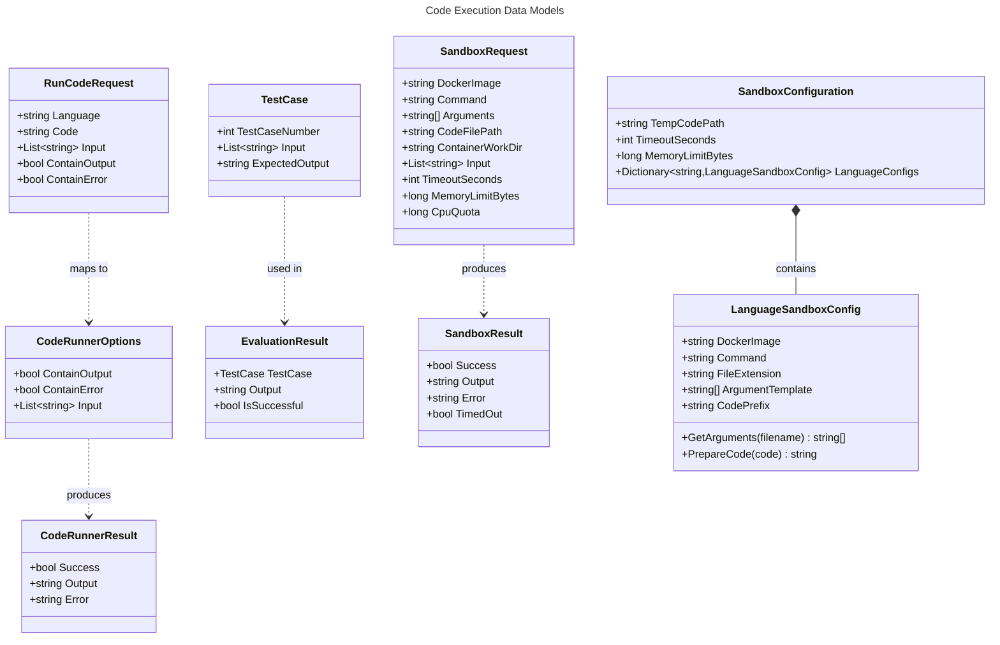

# Code Execution Data Models

This document describes the data models used in the code execution system.



## Request/Response Models

### RunCodeRequest

The request model sent from the client to execute code:

```csharp
// Backend & Client
public class RunCodeRequest
{
    public required string Language { get; set; }
    public required string Code { get; set; }
    public required List<string> Input { get; set; }
    public required bool ContainOutput { get; set; }
    public required bool ContainError { get; set; }
}
```

| Property | Type | Description |
|----------|------|-------------|
| `Language` | string | Programming language (e.g., "CSharp", "Python") |
| `Code` | string | Source code to execute |
| `Input` | List\<string\> | Lines of input for stdin |
| `ContainOutput` | bool | Whether to capture stdout |
| `ContainError` | bool | Whether to capture stderr |

### CodeRunnerOptions

Internal options passed to code runners:

```csharp
public class CodeRunnerOptions
{
    public bool ContainOutput { get; set; } = false;
    public bool ContainError { get; set; } = false;
    public List<string> Input { get; set; } = [];
}
```

### CodeRunnerResult

The result of code execution:

```csharp
public class CodeRunnerResult
{
    public bool Success { get; set; }
    public string? Output { get; set; }
    public string? Error { get; set; }
}
```

| Property | Type | Description |
|----------|------|-------------|
| `Success` | bool | `true` if exit code was 0 |
| `Output` | string? | Captured stdout (if successful) |
| `Error` | string? | Captured error output (if failed) |

## Test Case Models

### TestCase

Defines input/output expectations for evaluation:

```csharp
// Backend
public class TestCase
{
    public required int TestCaseNumber { get; set; }
    public required List<string> Input { get; set; }
    public required string ExpectedOutput { get; set; }
}

// Client (with observable support)
public class TestCase : BaseObservableModel
{
    public required int TestCaseNumber { get; set; }
    public required List<string> Input { get; set; }
    public required string ExpectedOutput { get; set; }
    
    // Helper property for UI binding
    public string InputInOneString
    {
        get => string.Join('\n', Input);
        set => Input = value.Split('\n').ToList();
    }
}
```

### EvaluationResult

The result of evaluating code against a test case:

```csharp
public class EvaluationResult
{
    public required TestCase TestCase { get; set; }
    public required string Output { get; set; }
    public required bool IsSuccessful { get; set; }
}
```

| Property | Type | Description |
|----------|------|-------------|
| `TestCase` | TestCase | The test case that was evaluated |
| `Output` | string | Actual output from code execution |
| `IsSuccessful` | bool | `true` if output matches expected |

## Sandbox Models

### SandboxRequest

Request to execute code in a Docker container:

```csharp
public record SandboxRequest
{
    public required string DockerImage { get; init; }
    public required string Command { get; init; }
    public required string[] Arguments { get; init; }
    public required string CodeFilePath { get; init; }
    public required string ContainerWorkDir { get; init; }
    public List<string> Input { get; init; } = [];
    public int TimeoutSeconds { get; init; } = 10;
    public long MemoryLimitBytes { get; init; } = 128 * 1024 * 1024;
    public long CpuQuota { get; init; } = 50000;
}
```

| Property | Default | Description |
|----------|---------|-------------|
| `DockerImage` | - | Docker image to use |
| `Command` | - | Command to run in container |
| `Arguments` | - | Command arguments |
| `CodeFilePath` | - | Host path to code file |
| `ContainerWorkDir` | - | Working directory in container |
| `Input` | `[]` | Stdin input lines |
| `TimeoutSeconds` | `10` | Execution timeout |
| `MemoryLimitBytes` | `128MB` | Memory limit |
| `CpuQuota` | `50000` | CPU quota (50%) |

### SandboxResult

Result from Docker container execution:

```csharp
public record SandboxResult
{
    public bool Success { get; init; }
    public string? Output { get; init; }
    public string? Error { get; init; }
    public bool TimedOut { get; init; }
}
```

## Configuration Models

### SandboxConfiguration

Global sandbox settings:

```csharp
public class SandboxConfiguration
{
    public string TempCodePath { get; set; } = "/tmp/code";
    public int TimeoutSeconds { get; set; } = 10;
    public long MemoryLimitBytes { get; set; } = 128 * 1024 * 1024;
    public Dictionary<string, LanguageSandboxConfig> LanguageConfigs { get; set; } = [];
}
```

### LanguageSandboxConfig

Per-language sandbox settings:

```csharp
public class LanguageSandboxConfig
{
    public required string DockerImage { get; set; }
    public required string Command { get; set; }
    public required string FileExtension { get; set; }
    public string[] ArgumentTemplate { get; set; } = ["{filename}"];
    public string? CodePrefix { get; set; }

    public string[] GetArguments(string filename) =>
        ArgumentTemplate.Select(arg => arg.Replace("{filename}", filename)).ToArray();

    public string PrepareCode(string code) =>
        string.IsNullOrEmpty(CodePrefix) ? code : CodePrefix + code;
}
```

## Service Interfaces

### ICodeRunner

```csharp
public interface ICodeRunner
{
    string Language { get; }
    Task<CodeRunnerResult> RunCodeAsync(string code, CodeRunnerOptions? options = null);
}
```

### ICodeRunnerFactory

```csharp
public interface ICodeRunnerFactory
{
    ICodeRunner Create(string language);
}
```

### IEvaluator

```csharp
public interface IEvaluator
{
    Task<EvaluationResult> EvaluateAsync(string language, string code, TestCase testCase);
}
```

### IDockerSandbox

```csharp
public interface IDockerSandbox
{
    Task<SandboxResult> ExecuteAsync(
        SandboxRequest request, 
        CancellationToken cancellationToken = default);
}
```

## Exception Types

### CodeRunnerException

```csharp
public class CodeRunnerException(string message = "Failed to run code") : Exception(message)
{
}
```

Thrown when:
- Code file cannot be written
- Process fails to start
- Unexpected execution error occurs

## API Response Wrapper

All API responses use the standard wrapper:

```csharp
public class ApiResponse<T>
{
    public bool Success { get; set; }
    public T? Data { get; set; }
    public string? Message { get; set; }
}
```

Example response:
```json
{
    "success": true,
    "data": {
        "success": true,
        "output": "Hello, World!",
        "error": null
    },
    "message": null
}
```
