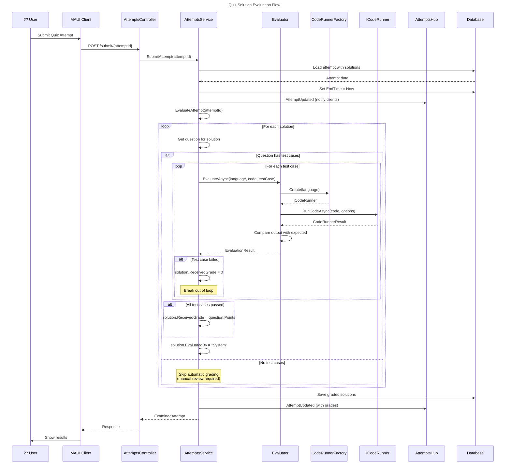
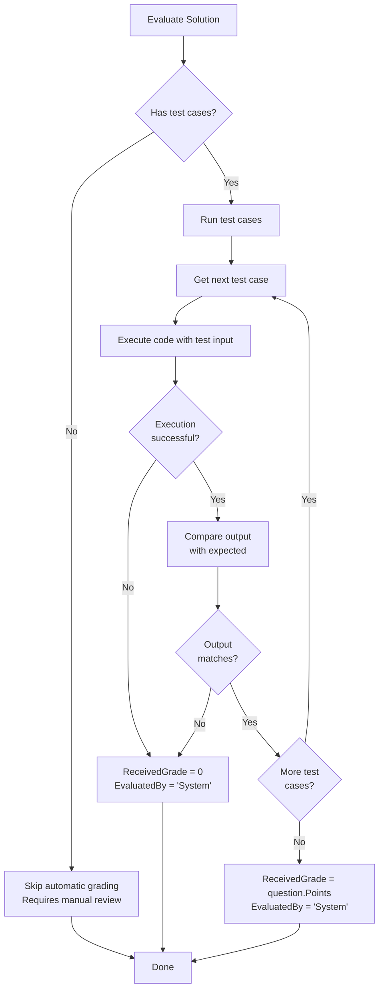

# Quiz Solution Evaluation Flow

This document describes how quiz solutions are automatically evaluated against test cases.



## Evaluation Process

### 1. Submit Attempt

When a user submits their quiz attempt:

```csharp
public async Task<ExamineeAttempt> SubmitAttempt(int attemptId)
{
    var attempt = await dbContext.Attempts
        .Where(a => a.Id == attemptId)
        .Include(a => a.Quiz).ThenInclude(q => q.Questions)
        .Include(a => a.Solutions)
        .FirstOrDefaultAsync();

    attempt.EndTime ??= DateTime.Now;
    await dbContext.SaveChangesAsync();
    
    // Notify connected clients
    await attemptsHubContext.Clients.All.SendAsync("AttemptUpdated", ...);
    
    // Trigger automatic evaluation
    await EvaluateAttempt(attempt.Id);
    
    return attempt.ToExamineeAttempt();
}
```

### 2. Grade Solutions

```csharp
private void GradeAttemptSolutions(Attempt attempt)
{
    foreach (var solution in attempt.Solutions)
    {
        var question = attempt.Quiz.Questions.First(q => q.Id == solution.QuestionId);
        
        if (!question.TestCases.IsNullOrEmpty())
        {
            var correctSolution = TestCasesPassed(attempt.Quiz, question, solution);
            solution.ReceivedGrade = correctSolution ? question.Points : 0;
            solution.EvaluatedBy = "System";
        }
    }
}
```

### 3. Run Test Cases

```csharp
private bool TestCasesPassed(Quiz quiz, Question question, Solution solution)
{
    var questionConfig = question.QuestionConfiguration ?? quiz.GlobalQuestionConfiguration;
    
    foreach (var testCase in question.TestCases)
    {
        var result = evaluator.EvaluateAsync(
            questionConfig.Language, 
            solution.Code, 
            testCase
        ).Result;
        
        if (!result.IsSuccessful)
        {
            return false;
        }
    }
    return true;
}
```

## Evaluator Implementation

```csharp
public class Evaluator(ICodeRunnerFactory codeRunnerFactory) : IEvaluator
{
    public async Task<EvaluationResult> EvaluateAsync(
        string language, 
        string code, 
        TestCase testCase)
    {
        var codeRunner = codeRunnerFactory.Create(language);
        var result = await codeRunner.RunCodeAsync(code, new CodeRunnerOptions
        {
            Input = testCase.Input,
            ContainOutput = true,
            ContainError = true
        });

        return new EvaluationResult
        {
            TestCase = testCase,
            Output = result.Output ?? string.Empty,
            IsSuccessful = result.Success && 
                          (result.Output?.Trim() == testCase.ExpectedOutput.Trim())
        };
    }
}
```

## Evaluation Decision Flow



## Test Case Structure

```csharp
public class TestCase
{
    public required int TestCaseNumber { get; set; }
    public required List<string> Input { get; set; }
    public required string ExpectedOutput { get; set; }
}
```

### Example Test Case

```json
{
    "testCaseNumber": 1,
    "input": ["5", "3"],
    "expectedOutput": "8"
}
```

## Output Comparison

The evaluator compares outputs after trimming whitespace:

```csharp
IsSuccessful = result.Success && 
              (result.Output?.Trim() == testCase.ExpectedOutput.Trim())
```

This means:
- Leading/trailing whitespace is ignored
- Internal whitespace must match exactly
- Case-sensitive comparison

## Grading Modes

| Mode | Condition | Grade Assigned |
|------|-----------|----------------|
| **All Pass** | All test cases pass | `question.Points` (full points) |
| **Any Fail** | Any test case fails | `0` (no points) |
| **No Tests** | Question has no test cases | Not graded (manual review) |

## Real-time Updates

The evaluation system uses SignalR to notify clients of updates:

```csharp
await attemptsHubContext.Clients.All.SendAsync(
    "AttemptUpdated", 
    attempt.ToExaminerAttempt(),  // For examiner view
    attempt.ToExamineeAttempt()   // For examinee view
);
```

This enables:
- Live grade updates for examinees
- Real-time monitoring for examiners
- Immediate feedback after submission

## Configuration Inheritance

Questions can have their own configuration or inherit from quiz:

```csharp
var questionConfig = question.QuestionConfiguration ?? quiz.GlobalQuestionConfiguration;
```

This allows:
- Quiz-wide language setting
- Per-question language override
- Flexible multi-language quizzes
