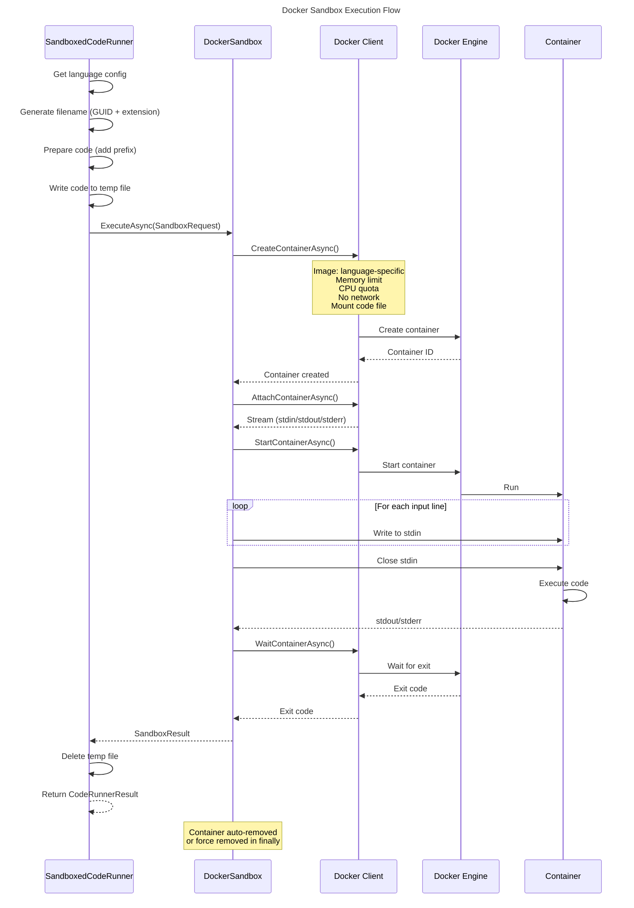
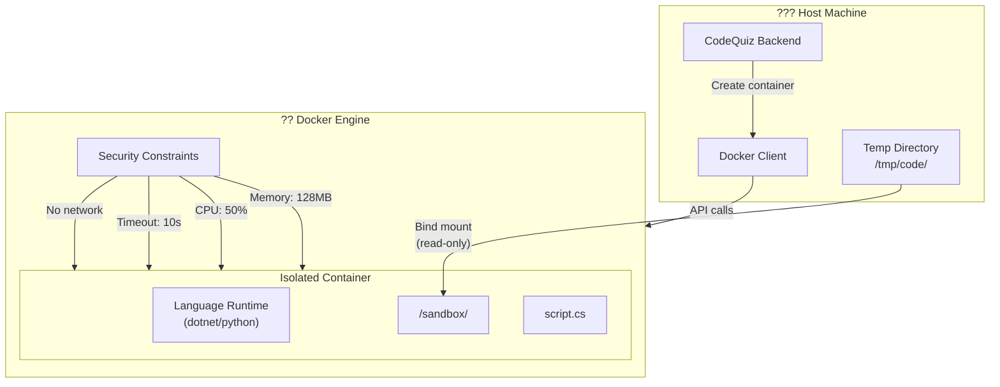
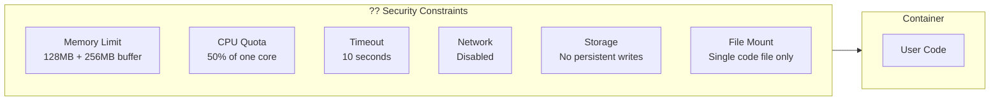
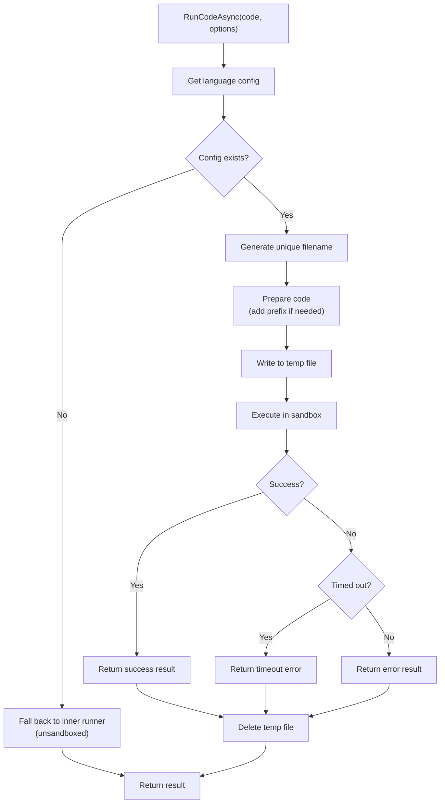

# Docker Sandbox Execution

This document describes the sandboxed code execution system using Docker containers for secure isolation.



## Sandbox Architecture



## Container Configuration

### SandboxRequest

```csharp
public record SandboxRequest
{
    public required string DockerImage { get; init; }
    public required string Command { get; init; }
    public required string[] Arguments { get; init; }
    public required string CodeFilePath { get; init; }
    public required string ContainerWorkDir { get; init; }
    public List<string> Input { get; init; } = [];
    public int TimeoutSeconds { get; init; } = 10;
    public long MemoryLimitBytes { get; init; } = 128 * 1024 * 1024;  // 128MB
    public long CpuQuota { get; init; } = 50000;  // 50% of one CPU
}
```

### Container Creation Parameters

```csharp
new CreateContainerParameters
{
    Image = request.DockerImage,
    Cmd = [request.Command, "/app/script.cs"],
    HostConfig = new HostConfig
    {
        Memory = request.MemoryLimitBytes + 256 * 1024 * 1024,
        CPUQuota = request.CpuQuota,
        Binds = [$"{request.CodeFilePath}:/app/script.cs"],
        AutoRemove = true
    }
}
```

## Language Configurations

### C# Configuration

```csharp
["CSharp"] = new LanguageSandboxConfig
{
    DockerImage = "mcr.microsoft.com/dotnet/sdk:10.0",
    Command = "dotnet",
    FileExtension = ".cs",
    ArgumentTemplate = ["run", "/sandbox/{filename}"],
    CodePrefix = "#pragma warning disable\n"
}
```

### Python Configuration

```csharp
["Python"] = new LanguageSandboxConfig
{
    DockerImage = "python:3.12-slim",
    Command = "python",
    FileExtension = ".py",
    ArgumentTemplate = ["/sandbox/{filename}"]
}
```

## Security Constraints



| Constraint | Default Value | Purpose |
|------------|---------------|---------|
| Memory | 128MB (+256MB buffer) | Prevent memory exhaustion |
| CPU Quota | 50000 (50%) | Prevent CPU monopolization |
| Timeout | 10 seconds | Prevent infinite loops |
| Network | Disabled | Prevent external calls |
| Auto-remove | Enabled | Cleanup after execution |

## SandboxedCodeRunner Flow



## Result Mapping

```csharp
return new CodeRunnerResult
{
    Success = result.Success,
    Output = result.Output,
    Error = result.Error ?? (result.TimedOut ? "Execution timed out" : null)
};
```

## Timeout Handling

The sandbox implements timeout at two levels:

1. **Container-level**: Docker engine enforces execution time
2. **Client-level**: CancellationToken with timeout + 15 seconds buffer

```csharp
using var cts = CancellationTokenSource.CreateLinkedTokenSource(cancellationToken);
cts.CancelAfter(TimeSpan.FromSeconds(request.TimeoutSeconds + 15));
```

## Container Cleanup

Containers are cleaned up in multiple ways:

1. **Auto-remove**: `AutoRemove = true` in HostConfig
2. **Finally block**: Force removal if container still exists

```csharp
finally
{
    if (containerId is not null)
    {
        try
        {
            await _client.Containers.RemoveContainerAsync(containerId,
                new ContainerRemoveParameters { Force = true }, CancellationToken.None);
        }
        catch { /* Container may have been auto-removed */ }
    }
}
```

## Error Scenarios

| Scenario | Result |
|----------|--------|
| Execution timeout | `TimedOut = true`, Error = "Execution timed out" |
| Memory exceeded | Container killed, error returned |
| Compilation error | `Success = false`, Error contains compiler output |
| Runtime exception | `Success = false`, Error contains exception |
| Docker unavailable | Exception propagated to caller |
