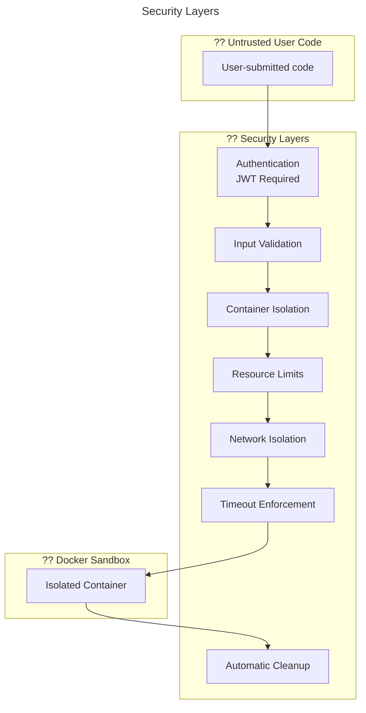
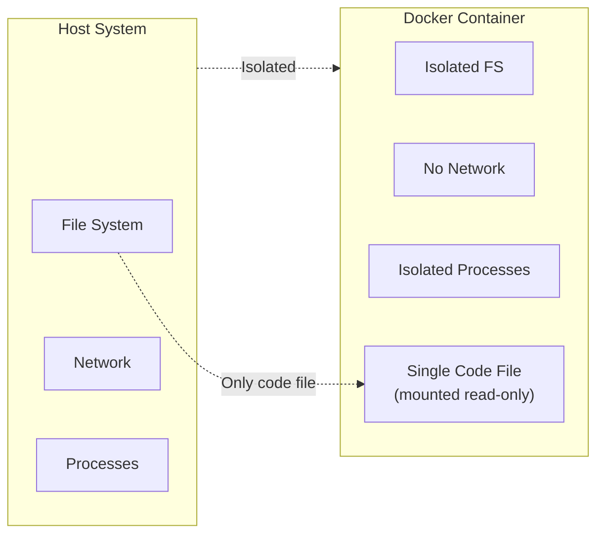
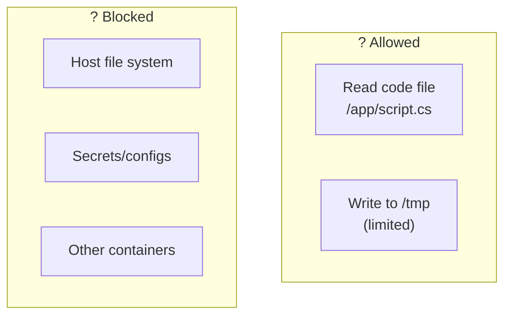
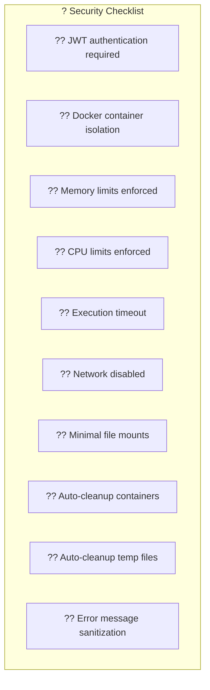

# Security Considerations

This document describes the security measures implemented in the code execution system to safely run untrusted user code.



## Threat Model

### Potential Attacks

| Attack Vector | Description | Mitigation |
|--------------|-------------|------------|
| **Resource exhaustion** | Infinite loops, memory bombs | CPU/memory limits, timeouts |
| **File system access** | Reading sensitive files | Container isolation, limited mounts |
| **Network attacks** | Outbound connections, data exfiltration | Network disabled |
| **Fork bombs** | Process multiplication | Process limits, container constraints |
| **Code injection** | Malicious code in input | Input sanitization, sandboxing |
| **Container escape** | Breaking out of container | Docker security, non-root user |

## Security Measures

### 1. Authentication

All code execution requests require JWT authentication:

```csharp
// In MauiProgram.cs
builder.Services.AddRefitClient<IExecutionAPI>()
    .ConfigureHttpClient(c => c.BaseAddress = new Uri(uri))
    .AddHttpMessageHandler<AuthHandler>();  // Adds JWT token
```

### 2. Container Isolation



### 3. Resource Limits

#### Memory Limit

```csharp
HostConfig = new HostConfig
{
    Memory = request.MemoryLimitBytes + 256 * 1024 * 1024,  // 128MB + buffer
    // MemorySwap = request.MemoryLimitBytes,  // Prevents swap
}
```

**Default**: 128MB + 256MB buffer = 384MB total

**Why buffer?** Runtime overhead for language runtimes (JIT compilation, etc.)

#### CPU Limit

```csharp
HostConfig = new HostConfig
{
    CPUQuota = request.CpuQuota,  // 50000 = 50% of one CPU
}
```

**Default**: 50% of one CPU core

#### Timeout

```csharp
public int TimeoutSeconds { get; init; } = 10;

// In DockerSandbox
cts.CancelAfter(TimeSpan.FromSeconds(request.TimeoutSeconds + 15));
```

**Default**: 10 seconds (+ 15 second buffer for container operations)

### 4. Network Isolation

```csharp
// NetworkDisabled prevents all network access
CreateContainerParameters
{
    // NetworkDisabled = true,  // When enabled
}
```

**Purpose**: Prevents:
- Data exfiltration
- External API calls
- Network-based attacks
- Downloading malicious payloads

### 5. File System Restrictions



Only the user's code file is mounted:

```csharp
Binds = [$"{request.CodeFilePath}:/app/script.cs"]
```

### 6. Code Preprocessing

The system adds safety preprocessor directives:

```csharp
// C# code preprocessing
code = "#pragma warning disable\n" + code;
```

This suppresses compiler warnings that could:
- Leak information about the system
- Cause compilation to fail unexpectedly

### 7. Automatic Cleanup

#### Container Cleanup

```csharp
HostConfig = new HostConfig
{
    AutoRemove = true  // Container removed after exit
}

// Plus forced cleanup in finally block
finally
{
    if (containerId is not null)
    {
        await _client.Containers.RemoveContainerAsync(containerId,
            new ContainerRemoveParameters { Force = true });
    }
}
```

#### Temp File Cleanup

```csharp
finally
{
    if (File.Exists(filePath))
    {
        try
        {
            File.Delete(filePath);
        }
        catch { /* Log warning */ }
    }
}
```

## Security Configuration

### Recommended Production Settings

```csharp
new SandboxConfiguration
{
    TempCodePath = "/tmp/code",
    TimeoutSeconds = 10,
    MemoryLimitBytes = 128 * 1024 * 1024,  // 128MB
    LanguageConfigs = new Dictionary<string, LanguageSandboxConfig>
    {
        ["CSharp"] = new()
        {
            DockerImage = "mcr.microsoft.com/dotnet/sdk:10.0",
            Command = "dotnet",
            FileExtension = ".cs",
            ArgumentTemplate = ["run", "/sandbox/{filename}"],
            CodePrefix = "#pragma warning disable\n"
        }
    }
}
```

### Additional Docker Security Options

Consider enabling these for production:

```csharp
HostConfig = new HostConfig
{
    // Resource limits
    Memory = 128 * 1024 * 1024,
    MemorySwap = 128 * 1024 * 1024,  // Disable swap
    CPUQuota = 50000,
    
    // Security options
    NetworkDisabled = true,
    ReadonlyRootfs = true,
    
    // Temporary filesystem
    Tmpfs = new Dictionary<string, string>
    {
        ["/tmp"] = "rw,noexec,nosuid,size=64m"
    },
    
    // Capabilities
    CapDrop = ["ALL"],  // Drop all capabilities
    
    // Security profile
    SecurityOpt = ["no-new-privileges:true"]
}
```

## Security Checklist



## Logging and Monitoring

### What to Log

```csharp
logger.LogInfo($"Created sandbox container: {containerId[..12]}");
logger.LogWarning("Sandbox execution timed out for container: {ContainerId}");
logger.LogError("Sandbox execution failed", ex);
```

### What to Monitor

| Metric | Purpose |
|--------|---------|
| Execution count | Detect abuse patterns |
| Timeout rate | Identify DoS attempts |
| Memory limit hits | Detect memory bombs |
| Error rate | Identify exploitation attempts |
| Execution time distribution | Performance monitoring |

## Known Limitations

1. **No GPU support**: Containers don't have GPU access
2. **No persistent storage**: All data lost after execution
3. **Limited language support**: Only configured languages work
4. **Single file execution**: Multi-file projects not supported
5. **No external dependencies**: Cannot install packages at runtime

## Best Practices

1. **Keep Docker images updated** for security patches
2. **Monitor container resource usage** for anomalies
3. **Rate limit** code execution requests per user
4. **Log all executions** for audit trail
5. **Regularly review** security configurations
6. **Test with malicious inputs** to verify protections
